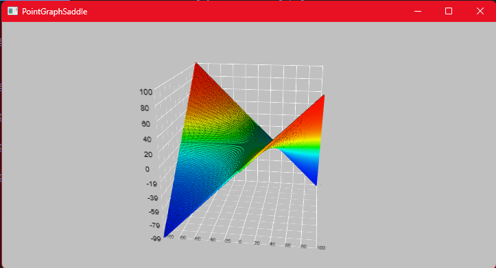
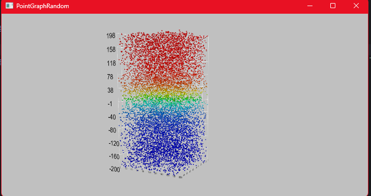
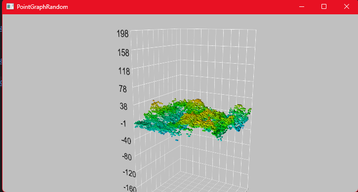

## **Курсовой проект на тему:**

### Решение по визуализации широкого набора показателей производства. Разработка алгоритмов и программ преобразования геометрической модели пространственной точечно заданной кривой.

#### Окно настройки

### Граф из файла

Директория для файлов - testtxtfiles

### Стандартные графы
#### Граф заданный функцией f(y) = sin(x) * cos(z);

#### Граф заданный функцией f(y) = sin(x)

#### Граф заданный функцией f(y) = (x * z)

Маленькая ремарка:
Для заготовленных тестовых данных при вычислении добавлены дополнительные переменные для облегчения масштабирования данных 

### Пример реализованной простейшей аппроксимации 

#### Случайно заданные точки

#### Аппроксимация при 15ти

### Управление 
#### *W* - поднимает камеру вверх
#### *S* - опускает камеру вниз
#### *A* - смещает камеру влево
#### *D* - смещает камеру вправо
#### *Q* - вращает камеру против часовой стрелки
#### *E* - вращает камеру по часовой стрелке
#### *R* - отдаление камеры
#### *F* - приближение камеры
#### *Колесико мыши* - тот же функционал, что и у клавиш F и R
#### *M* - возврат к окну настройки

